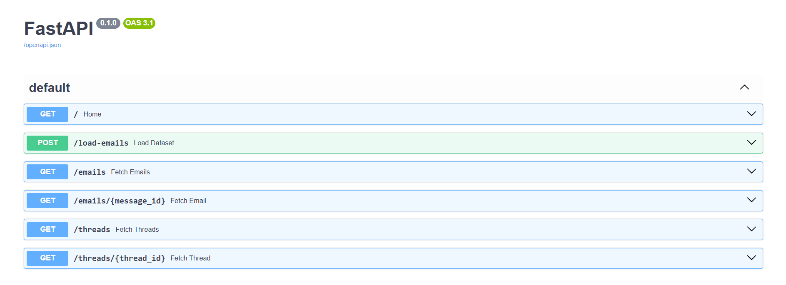
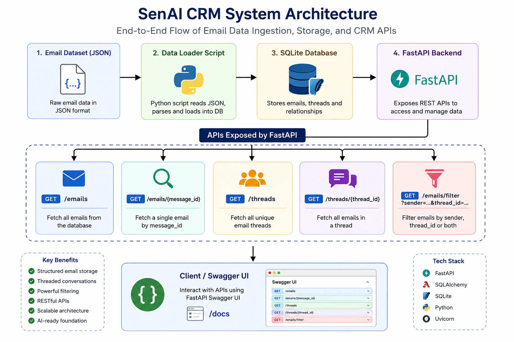

# SenAI CRM System

SenAI CRM is a backend-based Customer Relationship Management system built using **FastAPI** and **SQLite**.  
It ingests email datasets, stores them in a structured database, and exposes REST APIs to manage and analyze email conversations.

---

## 🚀 Features

### 📩 Email Management
- Load email dataset into database
- Fetch all emails
- Retrieve single email by message_id

### 🧵 Thread Management
- View all conversation threads
- Fetch complete email conversations by thread_id

### 🔍 Filtering Support
- Filter emails by sender
- Filter emails by thread_id
- Combined filtering support

---

## 🏗️ Tech Stack

- FastAPI
- SQLAlchemy
- SQLite
- Uvicorn
- Python 3.10+

---

## 📡 API Endpoints

| Method | Endpoint | Description |
|--------|----------|-------------|
| GET | `/` | Health check |
| POST | `/load-emails` | Load dataset into database |
| GET | `/emails` | Get all emails |
| GET | `/emails/{message_id}` | Get single email |
| GET | `/threads` | Get all threads |
| GET | `/threads/{thread_id}` | Get thread emails |

---

## 🔄 Data Flow

Email Dataset → Loader Service → SQLite DB → FastAPI → API Response

---

## 🧠 Future Enhancements

- AI-based email classification
- Spam detection system
- Sentiment analysis
- Lead scoring system
- Email summarization using LLMs
- CRM analytics dashboard

---

## 📌 Purpose

This project demonstrates backend development skills including API design, database modeling, and scalable architecture, with future expansion into AI-powered CRM intelligence.

---

## ⚙️ Setup Instructions

```bash
pip install -r requirements.txt
uvicorn app.main:app --reload

## 📸 API Documentation



## 🏗️ Architecture Diagram

